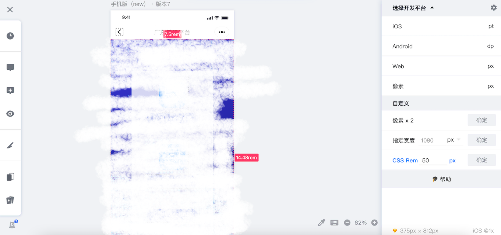

# 如何快速开发一个响应式移动端页面

## 适用领域

* 1、非工程化项目（不需要webpack之类的打包）
* 2、html+css页面数少的项目（例如：app下载页面、抽奖活动页面）
* 3、其实pc端页面也适用的，但用的少（例如：大屏数据可视化页面）

## 方法

主要是用淘宝的flexible.js配合[蓝湖](https://lanhuapp.com/)的原型设计图，达到快速开发的目的。

flexible可以根据不同的页面width给网页中html跟节点设置不同的font-size，配合rem可实现响应式页面。

flexible默认是750px的设计页面，基准值是7.5rem。这个基准值很关键，设计稿所有css换算，都和这个基准值有关。

页面动态font-size值=设计稿宽度/基准值rem宽度。

蓝湖可查看元素标注，自动生成CSS、iOS和Android代码。可以通过设置蓝湖的cssRem，自动转换所有元素的rem值，开发中很方便。

例如：设计稿宽度是375px的，页面动态font-size的值=375/7.5=50。如下设置，点击确定就行。

以上设置后，点击蓝湖中设计稿的元素，可以查看相关css代码，直接复制就可以使用。开发少量页面时，真的好快、好方便！

## Demo

做了个小demo，是根据375px的设计稿实现的，效果如下

[查看代码](https://github.com/liyoro/h5flexible)

[csdn下载代码](https://download.csdn.net/download/liyoro/20638552)